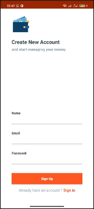
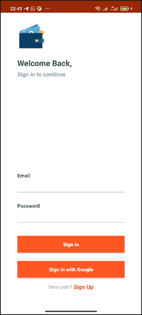
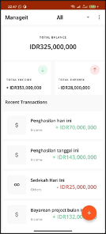
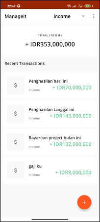
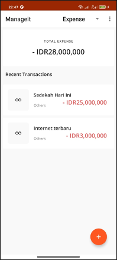
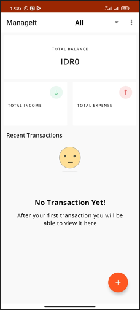
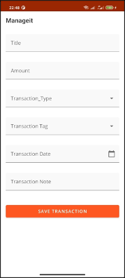
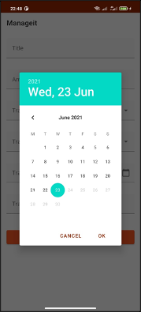
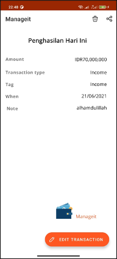
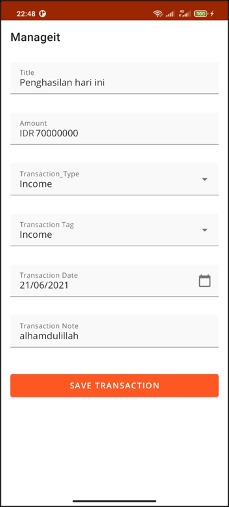

Managit
Managit is an Android application designed to help users effectively manage their income and expenses. Developed using the Kotlin programming language, this app offers a seamless and intuitive experience for users to track their financial activities in a convenient and organized manner.

Features
Real-Time Income and Expense Tracking: Managit enables users to monitor their income and expenses in real-time, providing them with a clear overview of their financial activities.
User-Friendly Interface: The app offers a user-friendly interface that allows users to easily add, categorize, and view their income and expenses. The intuitive design enhances the overall user experience.
Secure and Scalable Data Storage: Managit utilizes Firebase Firestore as the database, ensuring secure and scalable storage for user data. This allows for seamless synchronization of financial records across multiple devices, providing users with access to their data from anywhere.Managit
Managit is an Android application designed to help users effectively manage their income and expenses. Developed using the Kotlin programming language, this app offers a seamless and intuitive experience for users to track their financial activities in a convenient and organized manner.

Screenshots

Contributing
I appreciate contributions to this project. If you are interested in contributing, please follow the guidelines below:

Fork the repository and create your branch from main.
Make your changes, adhering to the project's coding standards and guidelines.
Test your changes thoroughly to ensure they function as intended.
Submit a pull request describing your changes, the problem they solve, and any additional information that might be helpful for reviewers.